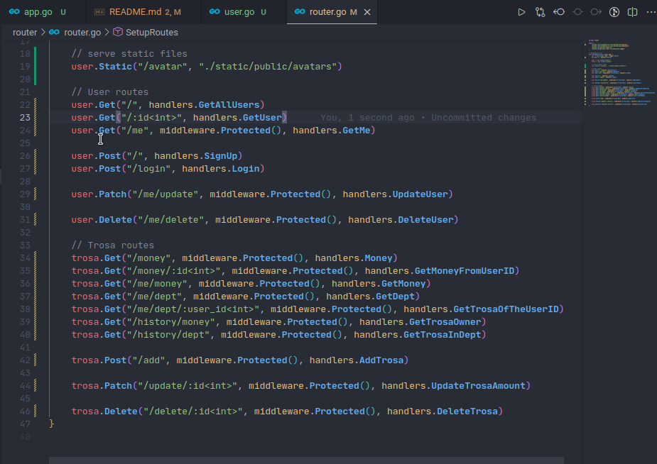

# Backend Trosa

This is the backend of the application Trosa developped to be an exercise.

## Development

### Start the application

```bash
go run app.go
```

### Use local container

```
# Clean packages
make clean-packages

# Generate go.mod & go.sum files
make requirements

# Generate docker image
make build

# Generate docker image with no cache
make build-no-cache

# Run the projec in a local container
make up

# Run local container in background
make up-silent

# Run local container in background with prefork
make up-silent-prefork

# Stop container
make stop

# Start container
make start
```

## Production

```bash
docker build -t gofiber .
docker run -d -p 3000:3000 gofiber ./app -prod
```

Go to <http://localhost:3000>

# Route



## API Reference

### Users

#### Login

```http
  POST /api/users/login
```

```json
{
    "identity": "nanta", # username or email
    "password": "password"
}
```

#### SignUp

```http
  POST /api/users/signup
```

```json
{
    "username": "nanta",
    "email": "nanta@example.com",
    "password": "password",
    "avatar": "avatar.png"

}
```

#### Get all users

```http
  GET /api/users
```

#### Get user by id

```http
  GET /api/users/:id
```

| Parameter | Type     | Description                       |
| :-------- | :------- | :-------------------------------- |
| `id`      | `int` | **Required**. Id of user to fetch |

#### Get current authenticated user

```http
  GET /api/users/me
```

#### Update user password

```http
  PATCH /api/users/update
```

```json
{
    "old_password": "",
    "new_password": "",
    "confirm_pass": ""
}
```

| Auth | Type     | Description                       |
| :-------- | :------- | :-------------------------------- |
| `jwt`      | `bearer` | **Required**. The user's token |

#### Get Avatar

```http
  GET /api/users/:id/avatar
```

| Parameter | Type     | Description                       |
| :-------- | :------- | :-------------------------------- |
| `id`      | `int` | **Required**. The id of the user |

#### Delete user

 ```http
   DELETE /api/users/me/delete
 ```

 ```json
 {
     "password": ""     # Required
 }
 ```

### Trosa (all operation here requires authenticated user)

#### List all Trosa

Return all money of the authenticated user

```http
  GET /api/trosa/me/money
```

#### List all dept

```http
  GET /api/trosa/me/dept
```

#### Get money of the user (check if he/she is in dept or not)

```http
  GET /api/trosa/money
```

#### Add new Trosa

```http
  POST /api/trosa/add
```

```json
{
    "amount": 5000
}
```
